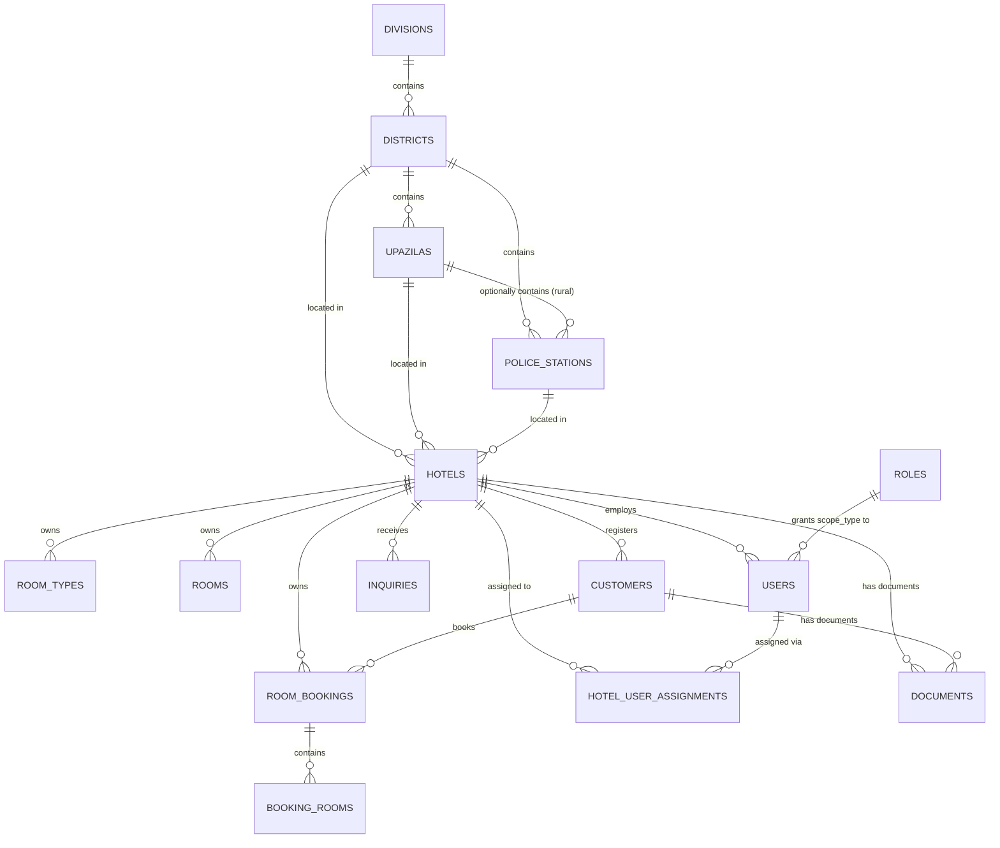

# Database Schema — HGRM SaaS

Companion to [PRD.md](PRD.md). Describes every new table and every change to an existing table,
grouped by the phase that introduces it (see [WORKFLOW-ROADMAP.md](WORKFLOW-ROADMAP.md) for
sequencing). Current-state facts below (table/column names, existing enums) were verified against
the migrations in `database/migrations/` and models in `app/Models/` on 2026-08-01.

## Tenancy strategy

**Decision: single database, shared schema, row-level `hotel_id` tenant column** on every
tenant-owned table, enforced by a global Eloquent scope + middleware — not separate databases per
hotel, not a multi-DB tenancy package.

Why: the dataset size (hotels, rooms, bookings, guests) is small-to-medium and doesn't need
per-tenant database isolation for performance. A shared schema means:

- Government cross-hotel queries (the entire point of this feature) are simple `WHERE hotel_id IN
(...)` joins instead of fan-out queries across N separate databases.
- One migration run updates every tenant; no per-tenant migration orchestration.
- Backups, reporting, and the existing `BackupController` keep working unchanged.

The tradeoff — a code bug in scoping could leak data across tenants — is exactly why Phase 7
requires explicit automated isolation tests rather than trusting the UI.

## Jurisdiction access model

Two mechanisms, checked in this order for any government-role user:

1. **Explicit assignment** (`hotel_user_assignments`) — if a user has one or more rows here,
   their visible hotel set is _exactly_ those hotels. This is the manual "assign a hotel to each
   user" behavior the R&D describes, useful for narrowing access (e.g. a junior officer handling
   only flagged properties) or granting access to a hotel just outside their normal jurisdiction.
2. **Jurisdiction auto-match** (default, no assignment rows) — the user's `district_id` /
   `upazila_id` / `police_station_id` (whichever is set, matching their role's `scope_type`) is
   compared against the same column on `hotels`. A DC user with `district_id = 5` automatically
   sees every hotel where `hotels.district_id = 5`. This is the "জেলার সব হোটেল দেখতে পারবে"
   requirement — zero manual setup per hotel.

This is implemented as one helper, not scattered per-controller logic:

```
App\Support\HotelAccess::visibleHotelIds(User $user): Collection|null
// null = unrestricted (super admin / hotel-role user uses their own hotel_id instead)
```

used by every government report/dashboard query and by a route-model-binding guard so a
government user can't open `/admin/hotels/{id}` for a hotel outside their set by editing the URL.

## ERD (new + changed tables)

Target picture across all phases. Built so far (2026-08-01): everything through `HOTELS`, its
direct `hotel_id` relations, `HOTEL_USER_ASSIGNMENTS`, and the `ROLES`/`USERS` jurisdiction link
(Phase 1–3), plus `DOCUMENTS` now actively used for hotel logos/certificates/photos (Phase 4).
`DOCUMENTS` rows for guests (NID/passport/visa/marriage certificate) are still Phase 5.



---

## Phase 1 — Geography reference data (new tables)

**Status: built and seeded (2026-08-01).** Migrations
`2026_08_01_100001` – `2026_08_01_100004`, models `Division`/`District`/`Upazila`/`PoliceStation`,
seeder `Database\Seeders\BdGeographySeeder`.

Divisions/districts/upazilas are seeded verbatim (source `id`s preserved, so `district_id = 9` is
reliably Cox's Bazar in every environment) from
[nuhil/bangladesh-geocode](https://github.com/nuhil/bangladesh-geocode), which itself cites
bangladesh.gov.bd and Wikipedia. Confirmed counts after seeding: **8 divisions, 64 districts, 494
upazilas** — matches the officially cited figures. The raw JSON snapshot used lives in
`database/seeders/data/bd-geocode/`.

### `divisions`

| Column  | Type             | Notes               |
| ------- | ---------------- | ------------------- |
| id      | bigint PK        | source id preserved |
| name    | string           | e.g. "Chattagram"   |
| name_bn | string, nullable | Bengali name        |

> Decision resolved: not in the original R&D, but Bangladesh's real hierarchy is Division →
> District, and government report rollups almost always end up wanting a division level
> eventually. Built now rather than deferred — one extra table, negligible cost.

### `districts`

| Column      | Type                     | Notes                                                                                                                          |
| ----------- | ------------------------ | ------------------------------------------------------------------------------------------------------------------------------ |
| id          | bigint PK                | source id preserved                                                                                                            |
| division_id | FK → divisions, required |                                                                                                                                |
| name        | string                   | e.g. "Coxsbazar" (source dataset's spelling — display-format as "Cox's Bazar" in UI if desired, don't rename the seeded value) |
| name_bn     | string, nullable         | জেলা নাম                                                                                                                       |

### `upazilas`

| Column      | Type             | Notes               |
| ----------- | ---------------- | ------------------- |
| id          | bigint PK        | source id preserved |
| district_id | FK → districts   | required            |
| name        | string           |                     |
| name_bn     | string, nullable |                     |

### `police_stations`

| Column      | Type                    | Notes                                                                                                          |
| ----------- | ----------------------- | -------------------------------------------------------------------------------------------------------------- |
| id          | bigint PK               |                                                                                                                |
| district_id | FK → districts          | required — every থানা belongs to a district                                                                    |
| upazila_id  | FK → upazilas, nullable | set for rural thanas that align with an upazila; null for metropolitan thanas that don't map 1:1 to an upazila |
| name        | string                  |                                                                                                                |
| name_bn     | string, nullable        |                                                                                                                |

> Modeling note: Police Station and Upazila are **siblings under District**, not strictly nested
> — a metropolitan area (e.g. Chattogram Metropolitan) has many police stations with no upazila
> at all. Modeling `police_stations.upazila_id` as nullable (rather than forcing
> `upazila → police_station` nesting) is what makes both rural and metro hotels representable.

> **Data-completeness caveat (important):** there is no verified open dataset for Bangladesh
> police stations/thana nationwide. What's seeded is a **rural approximation**: one
> `police_stations` row per upazila, name mirrored 1:1 from the upazila (true for the large
> majority of rural Bangladesh, and correctly covers Cox's Bazar, the client's own hotel's
> district). **Metropolitan police stations are NOT seeded** — Dhaka Metropolitan Police (~50
> thanas), and Chattogram/Rajshahi/Khulna/Sylhet/Barishal/Rangpur/Gazipur/Narayanganj Metropolitan
> Police, none of which map to an upazila, still need an official list sourced before any hotel
> in one of those metro areas can be registered with a correct police station. Tracked as an
> explicit follow-up task in [WORKFLOW-ROADMAP.md Phase 1](WORKFLOW-ROADMAP.md#phase-1--bangladesh-geography-reference-data),
> not silently guessed.

---

## Phase 2 — Hotels & multi-tenancy core

**Status: built and verified (2026-08-01).** Migrations `2026_08_01_100005` –
`2026_08_01_100008`, models `Hotel`/`Document`, trait `App\Models\Concerns\BelongsToHotel`,
resolver `App\Support\CurrentHotel`.

### `hotels`

| Column                  | Type                                       | Notes                                                                                                              |
| ----------------------- | ------------------------------------------ | ------------------------------------------------------------------------------------------------------------------ |
| id                      | bigint PK                                  |                                                                                                                    |
| name                    | string                                     |                                                                                                                    |
| slug                    | string, unique                             | future subdomain/URL use                                                                                           |
| trade_license_no        | string, nullable, unique                   | **nullable, deviates from the original plan** — see decision note below                                            |
| bin_no                  | string, nullable, unique                   | Business Identification Number                                                                                     |
| tin_no                  | string, nullable, unique                   | Tax Identification Number                                                                                          |
| owner_name              | string, nullable                           | **nullable, deviates from the original plan**                                                                      |
| owner_nid               | string, nullable                           | **nullable, deviates from the original plan**                                                                      |
| mobile                  | string                                     | required — real data existed for Tenant #1, no reason to allow blank                                               |
| email                   | string, nullable                           |                                                                                                                    |
| address                 | text                                       |                                                                                                                    |
| district_id             | FK → districts                             | required                                                                                                           |
| upazila_id              | FK → upazilas, nullable                    | null for metro/city-corporation hotels                                                                             |
| police_station_id       | FK → police_stations                       | required — every hotel falls under a থানা                                                                          |
| category                | string, nullable                           | see README open question — value set (star rating vs. tier label) pending client confirmation                      |
| total_rooms             | unsigned int                               | informational; actual `rooms` rows are the source of truth for availability                                        |
| logo                    | string (path), nullable                    | quick-display avatar; full photo gallery lives in `documents`                                                      |
| **is_primary_site**     | boolean, default false                     | **added during build, not in the original plan** — see decision note below                                         |
| status                  | enum: pending, active, suspended, rejected | default `active` for Phase 4 (Super-Admin-creates-hotel flow); revisit default if self-registration is added later |
| created_at / updated_at | timestamps                                 |                                                                                                                    |
| deleted_at              | soft delete                                | a suspended/closed hotel's historical guest data must be retrievable for government audit, never hard-deleted      |

> **Decision made during implementation — nullable legal-ID fields.** The original plan marked
> `trade_license_no`/`owner_name`/`owner_nid` required. Backfilling Tenant #1 (Hotel Beach Way)
> from its real `global_settings` data surfaced the problem directly: **the system has never
> stored a trade license number, BIN/TIN, or owner NID anywhere**, so a required field would have
> forced a fabricated placeholder into a legal-identifier column — exactly what this project's own
> data-honesty standard (see the police-station caveat above) rules out. Made nullable instead;
> Phase 4's hotel edit form is where a real value gets entered once the paperwork is on hand.

> **Addition made during implementation — `is_primary_site`.** Not in the original plan. Needed
> because the public marketing website (`FrontendController`/`FrontendBookingController`) still
> represents exactly one hotel and isn't multi-domain — some _deterministic_ way to answer "which
> hotel is the public site right now" was required once `RoomType`/`Room`/etc. became tenant-scoped
> (see `App\Support\CurrentHotel` below). One boolean, set `true` for Hotel Beach Way at backfill
> time, does this without guessing "hotel with the lowest id."

### `documents` (new, polymorphic — replaces one-column-per-file-type going forward)

Used for hotel documents (trade license/BIN/TIN certs, hotel photos) **and** guest documents
(NID front/back, passport scan, visa, Nikahnama, guest photo, other) — one reusable table instead
of a dozen single-purpose image columns, and open-ended for whatever document type shows up next.

| Column                  | Type                 | Notes                                                                                                                                                    |
| ----------------------- | -------------------- | -------------------------------------------------------------------------------------------------------------------------------------------------------- |
| id                      | bigint PK            |                                                                                                                                                          |
| documentable_type       | string               | `App\Models\Hotel` or `App\Models\Customer`                                                                                                              |
| documentable_id         | bigint               |                                                                                                                                                          |
| category                | string               | e.g. `trade_license`, `bin_certificate`, `hotel_photo`, `nid_front`, `nid_back`, `passport_scan`, `visa`, `marriage_certificate`, `guest_photo`, `other` |
| file_path               | string               | storage path, not publicly guessable — see PRD § 6                                                                                                       |
| original_filename       | string, nullable     |                                                                                                                                                          |
| uploaded_by             | FK → users, nullable |                                                                                                                                                          |
| created_at / updated_at | timestamps           |                                                                                                                                                          |

Index: `(documentable_type, documentable_id, category)`.

**First real use: Phase 4.** `Admin\HotelController` writes `trade_license`, `bin_certificate`,
`tin_certificate`, `owner_nid_copy` (single-file, replaced on re-upload — old file deleted from
disk) and `hotel_photo` (multi-file, additive) rows. Confirmed the "not publicly guessable" note
above holds in practice: `file_path` values are Laravel's default random hashed filenames (this
project's `public` disk writes straight to `public_path('storage')`, not a symlinked
`storage/app/public` — a pre-existing project customization, not something Phase 4 changed), so a
path can't be enumerated without already knowing it, even though there's no auth check on static
file serving itself.

### Add `hotel_id` to existing tenant-owned tables

| Table           | Change                                                                                                                                                                                                                                                           |
| --------------- | ---------------------------------------------------------------------------------------------------------------------------------------------------------------------------------------------------------------------------------------------------------------- |
| `room_types`    | + `hotel_id` FK → hotels, required                                                                                                                                                                                                                               |
| `rooms`         | + `hotel_id` FK → hotels, required _(technically derivable via `room_type_id`, but a direct column avoids a join on every availability query — this one is a deliberate denormalization for query cost, not laziness)_                                           |
| `customers`     | + `hotel_id` FK → hotels, required — see [§ customers](#customers-guests) below for why guests are per-hotel, not global. **Also**: the old global `unique(phone)` constraint was dropped and replaced with `unique(hotel_id, phone)` — see decision note below. |
| `room_bookings` | + `hotel_id` FK → hotels, required                                                                                                                                                                                                                               |
| `inquiries`     | + `hotel_id` FK → hotels, required                                                                                                                                                                                                                               |
| `users`         | + `hotel_id` FK → hotels, nullable — set for hotel-role staff, null for platform/government accounts                                                                                                                                                             |

Not touched: `booking_rooms`, `booking_followups`, `booking_logs` — each already resolves its
hotel via its parent `room_bookings.hotel_id`; adding the column there too would be redundant
denormalization with no query that needs it.

> **Fix made during implementation — `customers.phone` uniqueness.** The pre-existing schema had
> `phone` globally unique, which made sense under single-tenant (`FrontendBookingController::
resolveCustomer()` uses `updateOrCreate(['phone' => $phone], ...)` to match a repeat guest). Once
> guests are per-hotel (Decision #3), the same real person's phone number must be insertable
> **once per hotel** — a global unique constraint would have made the second hotel's very first
> repeat-phone booking throw a DB integrity error. Dropped `customers_phone_unique`, added
> `unique(hotel_id, phone)` instead, in the same migration as the backfill (see below) so the
> constraint change lands atomically with hotel_id being populated.

### Backfill — done for Tenant #1 (Hotel Beach Way), 2026-08-01

Executed inside `2026_08_01_100007_add_hotel_id_to_tenant_tables.php` (additive `hotel_id`
columns + backfill + the `customers` unique-constraint fix, all in one migration, following this
project's established two-step pattern from the `booking_rooms` introduction), then
`2026_08_01_100008_...` tightened the five business tables to `NOT NULL` in a follow-up migration:

1. Hotel Beach Way's real `district_id`/`upazila_id`/`police_station_id` resolved from the Phase 1
   geography tables (Cox's Bazar → Coxsbazar Sadar), and its `mobile`/`email`/`address` pulled
   from the existing `global_settings` (`header_phone`, `header_email`, `footer_address_line1/2`,
   `mail_from_name`) — not fabricated. `trade_license_no`/`owner_name`/`owner_nid` left `null`
   (see decision note above) and `total_rooms` set to the real count of existing `rooms` rows (58).
2. Every existing row in `room_types` (8), `rooms` (58), `customers` (14), `room_bookings` (2),
   `inquiries` (32), and `users` (3) — **all** of them, super admin included, since every account
   today genuinely is Hotel Beach Way staff — updated onto that hotel's id.
3. Verified via `artisan tinker`: counts match exactly (e.g. 58/58 rooms), and a rolled-back
   transactional test proved the isolation mechanics themselves — see
   [§ Tenant-scoping mechanism](#tenant-scoping-mechanism) below.

### Tenant-scoping mechanism

**Updated in Phase 3** — generalized from "one hotel_id" to "a set of visible hotel ids," so the
same mechanism now serves both hotel staff and jurisdiction-based government roles. Three pieces:
`app/Support/CurrentHotel.php`, `app/Support/HotelAccess.php` (new in Phase 3), and
`app/Models/Concerns/BelongsToHotel.php`, applied to `RoomType`, `Room`, `Customer`,
`RoomBooking`, `Inquiry` (not `User` — see below):

- **`CurrentHotel::visibleHotelIds(): ?array`** — the read-scope filter. Authenticated super
  admin → `null` (unrestricted). Authenticated non-super-admin → `HotelAccess::visibleHotelIds($user)`
  (see below). **Not authenticated** (the public marketing site, `artisan` commands, queue
  workers) → `[Hotel::primarySite()->id]` — the one hotel the public site currently represents.
  This is what lets `FrontendController`/`FrontendBookingController` keep every existing
  `RoomType::active()`, `Room::where(...)`, etc. call **completely unchanged** and still be
  correctly tenant-scoped — no controller edits were needed for the 8+ public read call sites.
- **`HotelAccess::visibleHotelIds(User $user): array`** (Phase 3) — checked in order: (1)
  `hotel_user_assignments` rows for this user, if any — the visible set is _exactly_ those hotels;
  (2) jurisdiction auto-match on `district_id`/`upazila_id`/`police_station_id` against `hotels`,
  whichever column applies to the user's role `scope_type`. A `scope_type = hotel` user with no
  `hotel_id`, or a `district` user with no `district_id`, resolves to `[]` — fails closed rather
  than defaulting to "everything."
- **`CurrentHotel::homeId(): ?int`** — the write-default used on `creating`. Always resolves to a
  single concrete hotel id when possible (the actor's own `hotel_id`, or the primary site for
  public form submissions), never `null` — a super admin or government account creating a record
  (shouldn't normally happen for government roles, which are permission-gated to view-only) still
  gets a real `hotel_id` stamped rather than nothing.
- **`BelongsToHotel` trait** — `addGlobalScope` now does `whereIn('hotel_id', $ids)` instead of a
  single `where(...) =`; an empty `$ids` array compiles to Laravel's always-false condition, so
  "no visible hotels" safely returns zero rows rather than needing special-case handling. `creating`
  still stamps `CurrentHotel::homeId()` unchanged from Phase 2.

> **Deliberate exclusion — not applied to `User`.** The original plan listed `users` among the
> models to scope. During implementation this turned out to be actively dangerous: Laravel's auth
> guard resolves the logged-in user via `User::find($id)` on every request, and a global scope that
> calls `auth()->check()`/`auth()->user()` _from inside that same lookup_ risks recursive or
> inconsistent resolution (the session's user isn't cached yet at the moment the guard is
> resolving it). `User` gets the `hotel_id`/`district_id`/`upazila_id`/`police_station_id`
> columns, relations, and manual per-controller scoping when it's needed (e.g. a future
> hotel-scoped "Users" list in Phase 4) — not the trait. Documented here because it's a real
> correction to the original plan, not silent drift.

**Verified 2026-08-01** two ways: (1) Phase 2's manual rolled-back `tinker` transaction, and (2)
Phase 3's permanent automated suite, `tests/Feature/HotelTenantIsolationTest.php` — 10 tests
against real HTTP requests (not just Eloquent queries), covering hotel isolation, all three
jurisdiction scope types, the fail-closed misconfigured-account case, the assignment-overrides-
jurisdiction semantic, super-admin unrestricted access, and unauthenticated public scoping. All
pass; full suite (35 tests) passes; confirmed via before/after row-count snapshots that running
the suite never touches the real dev database (see
[WORKFLOW-ROADMAP.md Phase 3](WORKFLOW-ROADMAP.md#phase-3--rbac--jurisdiction) for the test-
database fix this required).

**Route-model-binding guard — needed no new code.** The original plan called for a separate
middleware or model-binding override so an out-of-scope detail route (e.g.
`/admin/customers/{id}`) can't be opened by editing the URL. Turned out this already works: Laravel's
implicit route-model binding calls `Model::findOrFail()`, which already respects the global scope
above. Once that scope understood jurisdiction _sets_ (this phase), a government or hotel user
hitting an out-of-scope id already 404s — verified by the test suite, not assumed. Chose 404 over
403 deliberately: 403 would confirm the record exists at all, which leaks more than this system
should for guest data a user isn't authorized to know about.

---

## Phase 3 — RBAC & jurisdiction

**Status: built and verified (2026-08-01).** Migrations `2026_08_01_100009` – `_100011`, support
classes `App\Support\HotelAccess` + updated `App\Support\CurrentHotel`, seeder
`Database\Seeders\GovernmentRoleSeeder`, test `tests/Feature/HotelTenantIsolationTest.php`.

### `roles` (altered)

| Column     | Type                                                     | Notes                                                                                                                                                                                                                                                                                                     |
| ---------- | -------------------------------------------------------- | --------------------------------------------------------------------------------------------------------------------------------------------------------------------------------------------------------------------------------------------------------------------------------------------------------- |
| scope_type | enum: platform, hotel, district, upazila, police_station | default `hotel`. Drives which column on `users` is used to compute visible data. `is_super_admin` remains the unconditional bypass exactly as today — `scope_type` only matters for non-super-admin roles. Existing `super-admin` role updated to `platform` for hygiene (behaviorally inert either way). |

### `users` (altered)

| Column            | Type                           | Notes                                                      |
| ----------------- | ------------------------------ | ---------------------------------------------------------- |
| hotel_id          | FK → hotels, nullable          | already added in Phase 2                                   |
| district_id       | FK → districts, nullable       | set for `scope_type = district` users (DC Office)          |
| upazila_id        | FK → upazilas, nullable        | set for `scope_type = upazila` users (UNO Office)          |
| police_station_id | FK → police_stations, nullable | set for `scope_type = police_station` users (Police Admin) |

### Seeded test accounts (dev/QA only — password `password` for all)

| Email                           | Role         | Jurisdiction                   |
| ------------------------------- | ------------ | ------------------------------ |
| dc.coxsbazar@hgrm.test          | DC Office    | Cox's Bazar district           |
| dc.dhaka@hgrm.test              | DC Office    | Dhaka district                 |
| uno.coxsbazarsadar@hgrm.test    | UNO Office   | Coxsbazar Sadar upazila        |
| police.coxsbazarsadar@hgrm.test | Police Admin | Coxsbazar Sadar police station |

### `hotel_user_assignments` (new pivot)

| Column                  | Type                 | Notes                    |
| ----------------------- | -------------------- | ------------------------ |
| id                      | bigint PK            |                          |
| hotel_id                | FK → hotels          |                          |
| user_id                 | FK → users           |                          |
| assigned_by             | FK → users, nullable |                          |
| note                    | string, nullable     | why this override exists |
| created_at / updated_at | timestamps           |                          |

Unique on `(hotel_id, user_id)`.

### `ModuleRegistry` entries (added, code-level — no schema change)

- `hotel-registration` — Super Admin only: create/approve/suspend hotel tenants (route mapping
  for `admin.hotels.*` added ahead of Phase 4's actual routes).
- `gov-reports` — granted to DC/UNO/Police roles (and optionally hotel roles) for the
  guest/occupancy/nationality report set (route mapping for `admin.government.*` added ahead of
  Phase 6's actual routes). Deliberately **separate from** the existing `reports` module key,
  which covers hotel financials (Income, Discount) that government accounts must never see.

Existing `dashboard` and `customers` module keys are reused as-is for government roles; the
difference for them is row-level data scoping (via `HotelAccess`), not which screen they load.

### Seed data

`Database\Seeders\GovernmentRoleSeeder`: "DC Office" (`scope_type = district`), "UNO Office"
(`scope_type = upazila`), "Police Admin" (`scope_type = police_station`) — each granted `dashboard`

- `gov-reports` + read-only `customers` via `role_permissions`, nothing else. Plus 4 test accounts
  across 2 districts — see the table above.

---

## Phase 5 — Guest / customer KYC expansion

**Status: built and verified (2026-08-02).** Migration `2026_08_02_100001`, controller
`Admin\CustomerController` (new `edit`/`update`/`deleteDocument`), page
`Admin/Customers/Edit.vue`, shared components `WebcamCapture.vue` + `DocumentSlot.vue`, support
class `App\Support\DocumentUploader` (extracted here from Phase 4's `HotelController` — first
real reuse), `User::canManagePoliceFlag()`. Tests: `tests/Feature/CustomerKycTest.php` (8 tests).

### `customers` (guests) (altered)

Existing columns (unchanged): `name`, `phone`, `email`, `nationality`, `document_type` enum
(nid/passport/other), `nid_number`, `passport_number`, `document_image`.

> **Why guests stay per-hotel, not a global identity table**: the government requirement is "can
> I find this NID across hotels in my jurisdiction," which a `WHERE nid_number = ? AND hotel_id
IN (...)` query already answers. A global, deduplicated guest identity table would require
> identity-resolution logic (same name, different NID formatting, etc.) that nothing in the R&D
> asks for and that paper hotel registers don't attempt either. `hotel_id` was already added in
> Phase 2.

New columns:

| Column                   | Type                                | Notes                                                               |
| ------------------------ | ----------------------------------- | ------------------------------------------------------------------- |
| father_name              | string, nullable                    |                                                                     |
| mother_name              | string, nullable                    |                                                                     |
| gender                   | enum: male, female, other, nullable |                                                                     |
| date_of_birth            | date, nullable                      |                                                                     |
| occupation               | string, nullable                    |                                                                     |
| emergency_contact        | string, nullable                    |                                                                     |
| present_address          | text, nullable                      | replaces the flat `address` column's role going forward             |
| permanent_address        | text, nullable                      |                                                                     |
| district_id              | FK → districts, nullable            | guest's home district (distinct from the hotel's own district)      |
| upazila_id               | FK → upazilas, nullable             |                                                                     |
| police_station_id        | FK → police_stations, nullable      |                                                                     |
| post_code                | string, nullable                    |                                                                     |
| birth_certificate_number | string, nullable                    |                                                                     |
| driving_license_number   | string, nullable                    |                                                                     |
| is_foreign_guest         | boolean, default false              | gates the required-if fields below                                  |
| visa_number              | string, nullable                    | required (app-level validation) when `is_foreign_guest`             |
| arrival_date_bd          | date, nullable                      | "Date of Arrival in Bangladesh," required when `is_foreign_guest`   |
| is_couple                | boolean, default false              |                                                                     |
| spouse_name              | string, nullable                    | MVP scope — see upgrade path below                                  |
| marriage_date            | date, nullable                      |                                                                     |
| is_flagged               | boolean, default false              | Police-only "suspicious person" flag from PRD § 5.4                 |
| flagged_note             | text, nullable                      | visible to police-scoped roles only (enforce in policy, not schema) |

The old flat `document_image` column is left in place (existing rows keep working) but new
uploads — including the guest photo, whether captured via webcam or uploaded — go through the
`documents` polymorphic table (`documentable_type = App\Models\Customer`) using categories
`nid_front`, `nid_back`, `passport_scan`, `visa`, `marriage_certificate`, `guest_photo`, `other`.
No new upload writes to `document_image` going forward.

> **Marriage info upgrade path**: if the government side later needs the _spouse_ to be
> independently searchable by their own NID (not just a name string on the primary guest), that
> becomes a `booking_guests` table (`room_booking_id`, `customer_id` nullable self-reference or a
> second lightweight identity record, `relationship` enum) rather than columns on `customers`.
> Not built now because nothing in the current R&D asks for spouse-level search — adding it
> speculatively would be exactly the kind of premature structure this project avoids.

> **Decision made during implementation — where KYC completion happens.** The plan didn't specify
> whether the ~25 PRD § 5.3 fields belong on the booking-creation form or somewhere else. Put them
> on a new dedicated `Admin/Customers/Edit.vue` instead: bookings still capture only
> name/phone/email/nationality/document quickly at reservation time
> (`RoomBookingController::resolveCustomer()` untouched), and the full KYC form is filled in as a
> separate front-desk registration step — matching how hotels actually do compliance paperwork at
> physical check-in, not at the moment a room is reserved. Required adding `edit`/`delete` to the
> `customers` `ModuleRegistry` entry (it was `view`-only before), otherwise no role could ever be
> granted permission to use the new screen.

> **Real bug found and fixed via live verification, not the first test pass.** The Edit form
> submits via Inertia's `forceFormData: true` (required for the file uploads on the same form),
> which serializes JS checkbox booleans through `FormData` as the literal strings `"true"`/
> `"false"`. Laravel's `boolean` validation rule actually **rejects** the string `"false"`
> outright (confirmed via `tinker` — it only accepts `true`/`false`/`0`/`1`/`'0'`/`'1'`), so every
> real update silently failed validation whenever a checkbox was left unchecked. The first round
> of automated tests used PHP-native booleans in the test payload and passed anyway — they didn't
> reproduce the actual wire format a browser sends, so they didn't catch it. Only caught by
> exercising the real HTTP endpoint end to end (same "verify live" practice as Phase 4). Fixed in
> `CustomerController::validated()` by normalizing `is_foreign_guest`/`is_couple` via
> `$request->boolean()` before validation runs; a dedicated regression test now submits raw string
> `"true"`/`"false"` values specifically to keep this fixed.

---

## Phase 6 — Monitoring Reports & dashboards

**Status: built and verified (2026-08-02). No new tables** — this phase is purely read-side:
new code querying the schema Phases 1–5 already built, relying entirely on the tenant/
jurisdiction global scope from Phase 2/3 for correctness rather than adding any manual
`hotel_id` filtering.

**New code**: `App\Support\GovernmentStats` (shared occupancy aggregation — current guests,
today's check-ins/check-outs per hotel, 30-day trend), `Admin\GovernmentReportController`
(hotel-wise/guest/nationality/NID-search reports + CSV/PDF export), `DashboardController`
branching on the current user's role `scope_type` to pick between the hotel-operations
dashboard and the new government one, `admin/government/pdf.blade.php` (a second, generic PDF
template — `admin/reports/pdf.blade.php` from the existing `ReportController` hardcodes "Hotel
Beach Way" in its `<h1>`, which is wrong for a report that legitimately spans several hotels).

> **Why these queries are safe without writing `WHERE hotel_id IN (...)` anywhere**: `Customer`
> carries `App\Models\Concerns\BelongsToHotel` directly, so any `Customer::` query (the
> nationality report, NID search) is scoped automatically. `BookingRoom` deliberately does
> **not** carry it (Phase 2 decision — it resolves scope via its parent booking), so every query
> against it in `GovernmentStats`/`GovernmentReportController` goes through
> `whereHas('booking', ...)` or eager-loads the `booking` relation; since `RoomBooking` _is_
> scoped, that subquery/join is what actually restricts the result set to the current user's
> jurisdiction. This is the same pattern `Admin\ReportController` already used for its
> room-type/room breakdowns (`BookingRoom::whereHas('booking', ...)`) — Phase 6 didn't invent it,
> just relied on it being correct. Getting this backwards (filtering `BookingRoom` some other
> way that doesn't route through `booking`) would silently break jurisdiction scoping for that
> query alone; `GovernmentReportsTest` exists specifically to catch that class of regression.

> **Decision made during implementation — one Guest report screen, not three.** The original
> plan listed Guest-wise, Date-wise, and Foreign Guest as separate report types (matching the
> R&D's literal list). Built as one `Admin/Government/GuestReport.vue` with filters (hotel, date,
> foreign-only, status, and a police-only flagged-only toggle) instead — "Date-wise Report" and
> "Foreign Guest Report" are sidebar links to the same page with a preset query string
> (`?date=<today>` / `?foreign_only=1`). Required adding query-parameter support to
> `SidebarNavItem.vue`'s child links, which didn't exist before (child links only ever built a
> plain `route(name)` with no params).

---

## Phase 7 — Security hardening & audit trail

**Status: built and verified (2026-08-02).** Migration `2026_08_03_100001`, model
`App\Models\AuditLog`, support classes `App\Support\AuditLogger` (new) and
`App\Support\DocumentUploader` (altered — disk changed). New controller
`Admin\DocumentController`. Tests: `tests/Feature/DocumentSecurityTest.php` (8),
`tests/Feature/BookingFlowRegressionTest.php` (3), plus additions to `GovernmentReportsTest`.

### `audit_logs`

| Column                    | Type                 | Notes                                                                                             |
| ------------------------- | -------------------- | ------------------------------------------------------------------------------------------------- |
| id                        | bigint PK            |                                                                                                   |
| user_id                   | FK → users           | who                                                                                               |
| action                    | string               | `viewed_guest`, `viewed_guest_document`, `searched_nid`, `exported_report`                        |
| subject_type / subject_id | nullable polymorphic | what record (null for `searched_nid`/`exported_report`, which log their detail in `meta` instead) |
| meta                      | json, nullable       | e.g. which NID was searched, which report type/format was exported                                |
| created_at                | timestamp            | when — no `updated_at`; log rows are append-only (`AuditLog::UPDATED_AT = null`)                  |

`App\Support\AuditLogger::log()` only writes a row when the acting user is a super admin or has a
government `scope_type` (district/upazila/police_station) — routine hotel-staff use of their own
hotel's data is deliberately not logged, matching PRD § 6's actual concern (oversight access to
guest PII across hotels, not day-to-day hotel operations).

### Document storage: moved from `public` disk to `local` disk

**Real gap found during the Phase 7 security-pass checklist item, not just confirmed absent.**
Every `documents`-table file (hotel legal docs, all Phase 5 guest KYC documents) was written to
the `public` disk (`public_path('storage')`, served directly by the webserver, no auth) via
`App\Support\DocumentUploader`. Random hashed filenames made a path hard to _guess_ — which is a
different property from "not publicly reachable without auth," the thing this checklist item and
PRD § 6 actually require. Anyone with the exact URL, logged in or not, could fetch a guest's NID
scan.

**Fix**: `DocumentUploader::DISK` changed to `'local'` (`storage_path('app')`, not web-accessible
by default — confirmed via `config/filesystems.php`, this is Laravel's stock `local` disk,
untouched by this project's `public` disk customization). New `Admin\DocumentController::show`
serves files back out, re-checking on every request:

- **Module permission** — `hotel-registration` view for Hotel documents, `customers` view for
  Customer documents (a single generic module key can't express "either, depending on type,"
  hence a dedicated controller rather than routing this through `CheckModulePermission`).
- **Tenant/jurisdiction scope** — for Customer documents, by calling `Customer::find($id)` and
  checking it isn't `null`. Since `Customer` carries the same global scope every other guest query
  in this app relies on, this reuses that exact mechanism rather than re-implementing scope
  checking a second time. Hotels aren't tenant-scoped (Phase 2 decision — they're the tenant
  boundary), so hotel-document access is gated by permission alone, same as `HotelController`.

**Verified live**: uploaded a real trade-license PDF and a real guest NID scan through the actual
running app, confirmed the files exist under `storage/app/` and not `public/storage/`, confirmed
`dc.dhaka@hgrm.test` (in-jurisdiction) can view the NID scan while `dc.coxsbazar@hgrm.test`
(out-of-jurisdiction) gets 404, confirmed an unauthenticated request redirects to login, and
confirmed a real `viewed_guest_document` audit row was written with the correct category.

**No data migration was needed** — the `documents` table had zero rows on the real dev database
at the time of this fix (Phases 4–6's live verifications either didn't upload real files or used
`Storage::fake()`), so there was nothing physically stored under the old `public/storage/...`
paths to move.

> **Deliberately not moved**: `hotels.logo` (a plain column, not a `documents` row) stays on the
> `public` disk. It's a cosmetic quick-display avatar, not a legal/KYC document, and the PRD § 6
> concern this fix addresses is specifically citizen PII and hotel legal-registration scans — not
> a building photo. If a future phase adds public-facing hotel marketing pages, hotel gallery
> photos (`documents` category `hotel_photo`) may need their own public-facing path at that point;
> not needed today since nothing renders them outside the admin panel.

---

## Migration ordering summary

1. `divisions`, `districts`, `upazilas`, `police_stations` — no dependencies. **Done 2026-08-01.**
2. `hotels`, `documents` — `hotels` depends on districts/upazilas/police_stations existing.
   **Done 2026-08-01.**
3. Additive `hotel_id` columns (nullable) on `room_types`, `rooms`, `customers`, `room_bookings`,
   `inquiries`, `users` → **backfill** → follow-up migration making them `NOT NULL` + constrained
   (except `users.hotel_id`, which stays nullable). **Done 2026-08-01** — backfill ran inside the
   migration itself (not a separate script) since it's a one-off historical operation, not
   something a fresh install needs to repeat.
4. `roles.scope_type`, `users.district_id/upazila_id/police_station_id`, `hotel_user_assignments`.
   **Done 2026-08-01.**
5. `customers` KYC columns (additive, all nullable — no backfill blocking needed since they're
   optional). **Done 2026-08-02.**
6. `audit_logs` (Phase 7, independent). **Done 2026-08-02**, alongside the document-storage
   disk change (no schema migration for that part — a code-level fix, see Phase 7 above).
